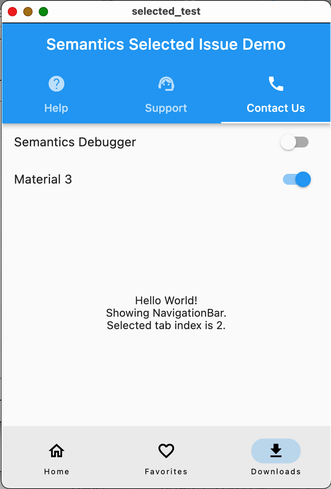
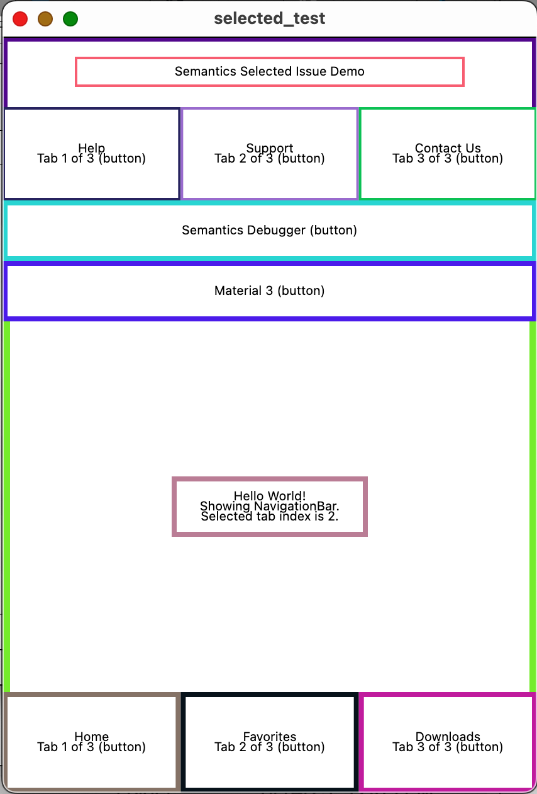

# selected_test

A Flutter project to demonstrate the lack of `selected` accessibility trait/status for selected items, especially tabs, on web (Chrome), and macOS.

This app has a simple home page with three tab components that demonstrate their accessibility issues and "hack" fixes.





__The first two tabs in each component are "hacked" to make them read out their selected status, and announce when selected. The third tab in each component is left alone with Flutter default behavior to show the below problems.__

## Flutter version
```
Flutter 3.10.5 • channel stable •
https://github.com/flutter/flutter.git
Framework • revision 796c8ef792 (3 days ago) • 2023-06-13
15:51:02 -0700
Engine • revision 45f6e00911
Tools • Dart 3.0.5 • DevTools 2.23.1
```

## macOS version
Apple M2 Pro, macOS Ventura 13.4 (22F66)

## Components shown
- [`BottomNavigationBar`](https://api.flutter.dev/flutter/material/BottomNavigationBar-class.html)
- [`NavigationBar`](https://api.flutter.dev/flutter/material/NavigationBar-class.html)
- [`TabBar`](https://api.flutter.dev/flutter/material/TabBar-class.html)

## Problem platforms
- macOS desktop
- web (Chrome, Safari) on macOS with VoiceOver

## Problems demonstrated
Tabs do not announce their `selected` state when:
- Focused with VoiceOver.
- Tapped with VoiceOver (and they become selected).

## User impact
- The user has no idea which tab is currently selected. Further, adding `selected,` to the label is bad practice because it should be in the value, not the label.
    - These are both Level A violations of WCAG success criteria 4.1.2 - Name, Role, Value.
- When the user taps a tab, there is no confirmation that it was selected.
    - Build this app to Android and note that it does announce when the tab is selected.

## Usage
- Run the app on macOS:
    - `flutter run -d macos`
    - `flutter run -d chrome`
- Turn on VoiceOver
    - On web, semantics is automatically enabled.
- Navigate to each of the tab bars and try selecting different tabs using VoiceOver.
- __IMPORTANT:__
    - The __first two tabs__ in each component are "hacked" to make them read out their selected status, and announce when they are selected. This is __bad practice__ for three reasons:
        - It requires each developer to do a lot of extra work to make these standard components accessible, that most developers will not know how to do.
        - It bypasses `MaterialLocalizations`.
        - It does not use proper accessibility roles/traits for the selected status. __The selected status seems to be missing from the engine on these platforms.__
    - The __third tab__ in each component is left alone to show that its selected status is not read out and that it does not announce itself when selected.
- Toggle the Material 3 switch to switch between `NavigationBar` and `BottomNavigationBar`
- Toggling the Semantics Debugger is self-explanatory.

## WCAG success criteria
[4.1.2 - Name, Role, Value (Level A)](https://www.w3.org/WAI/WCAG21/Understanding/name-role-value.html)
